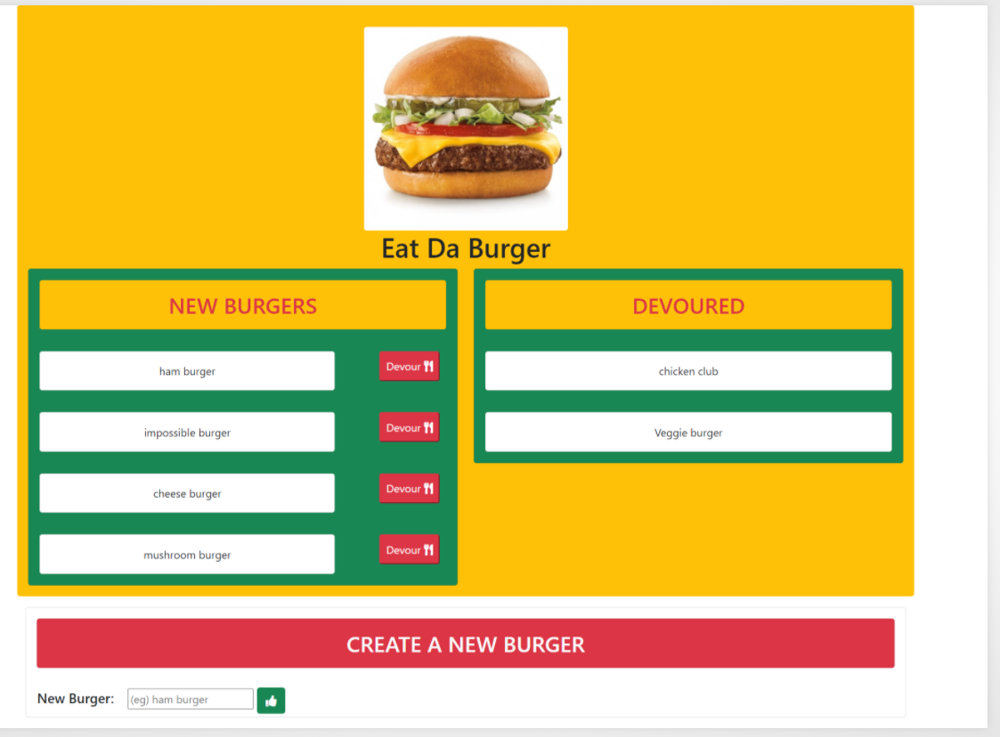

# Eat-da-burger

## Application details
This application was built on mvc architecture with server side rendering. The views were created using template engine handlebars.MYSQL database was used to store the data objects. Instead of using the standard sql inside the controller, used custom javascript orm for mapping the js objects with the data objects. The burger app is a simple full stack app which allows the user to post the name of the burger once they submit the burger name it shows up as list item inside the new burgers column, the user can type devour button, once its clicked the burger name shows as list item inside the devoured section. The routes were established using express router have used get, post and put methods for building the rest api. Used buit in helper methods in handlebars to show the dynamic data to the users.

## Techologies used
* NODEJS
* HANDLEBARS
* MYSQL
* EXPRESS
* BOOTSTRAP CSS
* ORM
* MVC

## DIRECTORY STRUCTURE
All the recommended files and directories from the steps above  look like the following structure:

```
.
├── config
│   ├── connection.js
│   └── orm.js
│ 
├── controllers
│   └── burgers_controller.js
│
├── db
│   ├── schema.sql
│   └── seeds.sql
│
├── models
│   └── burger.js
│ 
├── node_modules
│ 
├── package.json
│
├── public
│   └── assets
│       ├── css
│       │   └── burger_style.css
│       └── img
│           └── burger.png
│   
│
├── server.js
│
└── views
    ├── index.handlebars
    └── layouts
        └── main.handlebars
```

## MOCKUP


## HEROKKU LINK
[eat da burger]()